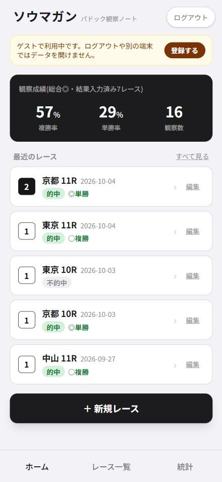
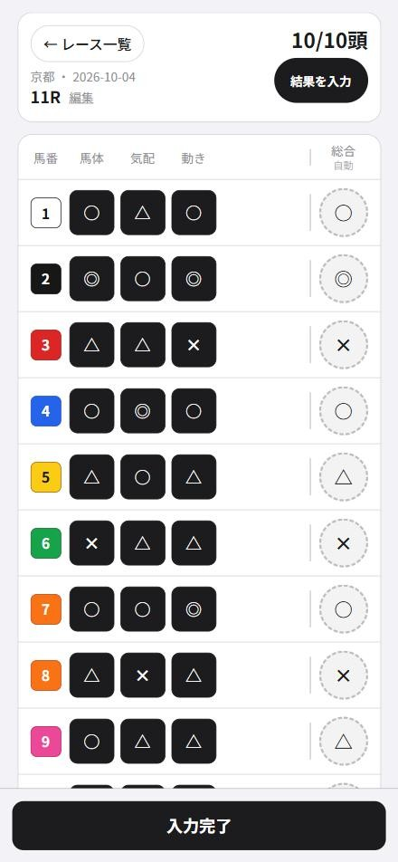
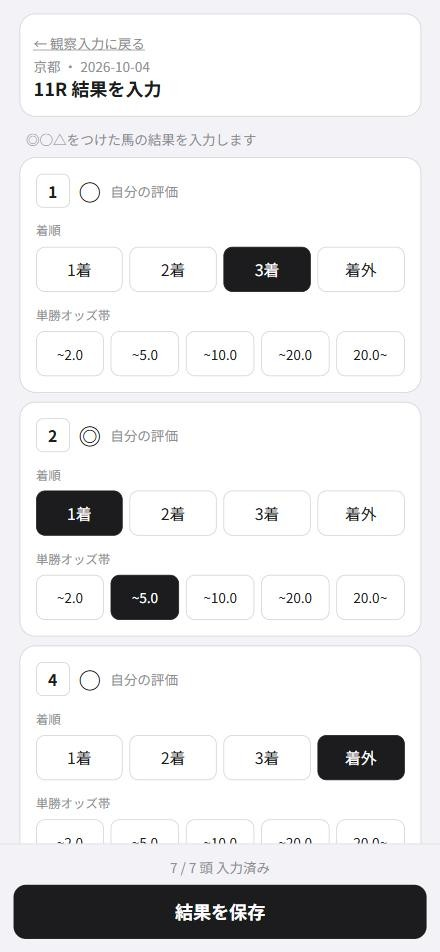
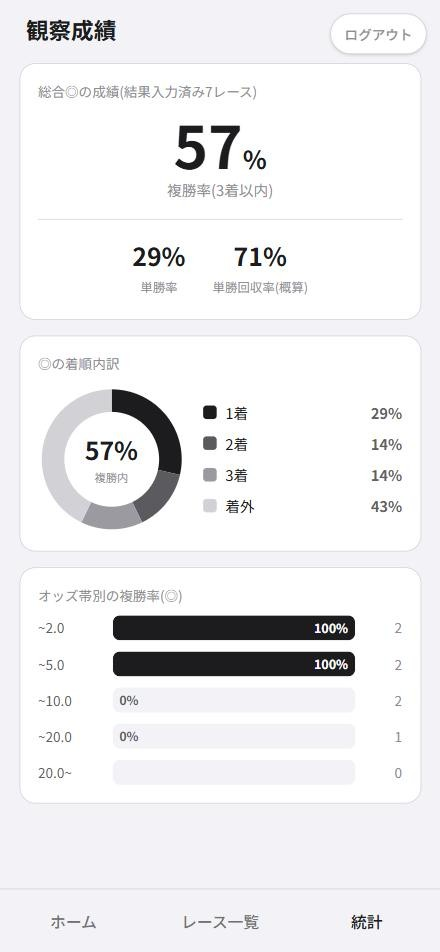

# ソウマガン — パドック観察ノート

競馬のパドックで馬を観察して記録し、レース結果と照らし合わせて「自分の見る目(相馬眼)」がどれだけ当たっているかを数字で確かめるためのスマホ向けWebアプリです。

**デモ: https://paddock-note-six.vercel.app**(「登録せずに使ってみる」からメールアドレスなしで試せます)

<p>
  
  
  
  
</p>

## 作った理由

パドック観察は競馬予想の楽しみの一つですが、「この馬は良く見えた」という感覚が実際に当たっているのかを振り返る手段がありませんでした。観察とレース結果を記録し続け、自分の評価がどのくらい着順につながっているかを数字で確認できるようにしたいと考えて作りました。

## 使い方の流れ

1. **レース登録** — 競馬場・日付・レース番号・頭数を入力
2. **パドック観察** — 各馬の「馬体」「気配」「動き」を◎○△×の4段階で評価
3. **結果入力** — レース後に着順(1着/2着/3着/着外)と単勝オッズ帯を入力
4. **成績の確認** — 総合◎を付けた馬の複勝率・単勝率・回収率(概算)などを集計

## 主な機能

- **総合評価の自動算出** — 馬体・気配・動きを◎4点〜×1点で合計し、レース内の順位で相対評価。最上位の1頭だけが◎、残りを○△×に3等分する。入力するたびに全馬の総合が再計算される
- **片手で素早く入力できる観察画面** — 枠番の色で馬番を表示。マスをタップして記号を選び、長押しで消去
- **途中保存と後からの修正** — 結果入力は全頭そろっていなくても完了でき、未入力の馬は着外として扱う。オッズ帯が未入力でも的中率には含め、回収率とオッズ帯別の集計からだけ除外する
- **統計ダッシュボード** — 総合◎の複勝率・単勝率・単勝回収率(概算)、着順内訳のドーナツグラフ、オッズ帯別の複勝率
- **アカウント** — メールアドレス+パスワードで複数端末から利用可能。登録せずにゲストとして使い始め、後からメールアドレスを登録してデータを引き継ぐこともできる

## 技術スタック

| 分類 | 使用技術 |
| --- | --- |
| フロントエンド | Next.js 16(App Router)/ React 19 / TypeScript / Tailwind CSS v4 |
| バックエンド | Supabase(PostgreSQL・認証・Row Level Security) |
| ホスティング | Vercel(Cron Jobsを含む) |

## 設計で工夫した点

- **ユーザーごとのデータ分離はDB側で保証** — 全テーブルに`user_id`を持たせ、Row Level Securityで`auth.uid() = user_id`の行しか読み書きできないようにしている。アプリのコードにバグがあっても他人のデータは見えない
- **待たせない入力(楽観的更新)** — 入力内容を先に画面へ反映し、保存はバックグラウンドで行う。保存に失敗したときだけ元の状態に戻す
- **素早い連続入力でもデータを失わない** — 同じ行への保存は1件ずつ順番に送り、送信時点の最新の内容を書き込む。並行して送ると、遅れて届いた古いリクエストが新しい内容を上書きしてしまうため。1回の操作で同じ馬の複数項目(手入力した項目と自動計算された総合)が変わる場合は、1回の書き込みにまとめている
- **連続操作でも状態が古くならない工夫** — 同じイベント内で状態更新が何度も呼ばれても最新の値を参照できるよう、`useState`と`useRef`を同期させている
- **無料プランの自動停止対策** — Supabaseの無料プランは1週間アクセスがないと停止するため、Vercel Cronで1日1回軽いクエリを送っている

## ディレクトリ構成

```
app/
  (app)/          ログインが必要な画面(ホーム・レース一覧・観察・結果・統計)
  login/          ログイン画面
  api/keep-alive/ Supabaseの自動停止を防ぐ定期実行用API
components/       画面・UI部品
lib/
  store.tsx       データの読み書きと集計(Supabase連携・楽観的更新)
  observationScore.ts  総合評価の自動算出ロジック
  supabase/       Supabaseクライアントと型変換
supabase/migrations/   DBスキーマとRLSポリシー
proxy.ts          未ログイン時のリダイレクトとセッション更新
```

## ローカルで動かす

1. [Supabase](https://supabase.com)でプロジェクトを作成し、SQL Editorで`supabase/migrations/`のSQLを番号順に実行する
2. Authenticationの設定で、メール認証と匿名ログイン(ゲスト用)を有効にする
3. `.env.example`をコピーして`.env.local`を作り、SupabaseのURLとpublishable keyを設定する
4. 依存パッケージを入れて起動する

```bash
npm install
npm run dev
```

http://localhost:3000 を開くと使えます。

## 今後の予定

- 観察項目の詳細化(毛づや・踏み込みなど)と、項目ごとの的中率の集計
- ひとことメモ
- PWA対応(ホーム画面に追加してアプリのように使えるようにする)
